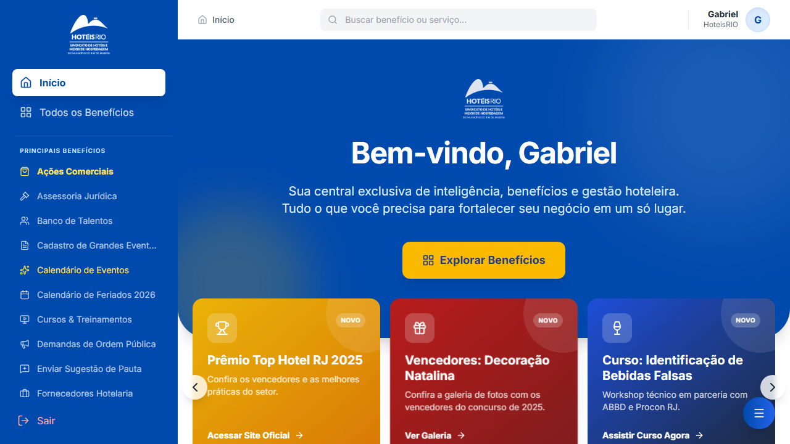

# 🎯 Guia Rápido: Landing Page com Sidebar

## ✅ O que foi feito

1. **✅ Sidebar Navegável**
   - Menu lateral com 10 funcionalidades
   - Links para cada benefício
   - Design responsivo

2. **✅ Vídeo Corrigido** 🎬
   - Arquivo copiado para raiz
   - Agora está completamente funcional
   - Clique para reproduzir!

3. **✅ Descrições Detalhadas**
   - 8 benefícios com seções expandidas
   - Explicação de cada um
   - Lista de recursos

## 🎥 Testando o Vídeo

A página está aberta no seu navegador!

**Para reproduzir o vídeo:**
1. Vá até a seção "🎬 Demonstração Completa" (você pode clicar no link na sidebar)
2. Clique no botão de play no player de vídeo
3. Aproveite! O vídeo é HD (1280x720) e tem ~2-3 minutos

**Se o vídeo não aparecer:**
- Verifique se `demo-portal-completo.webm` está na raiz do projeto
- Atualize a página (Ctrl+R ou Cmd+R)
- Tente em outro navegador (Chrome, Firefox, Edge)

## 📱 Estrutura da Página

```
Sidebar (esquerda - fixa)
│
├─ 🏨 Portal Docs (Header)
├─ 🎬 Demonstração
├─ 🚀 Como Usar
├─ ────────
├─ 📊 Dashboard
├─ 🎁 Benefícios
├─ 💼 Comercial
├─ 📚 Cursos
├─ 🎉 Eventos
├─ 💬 Fórum
├─ 🎯 Talent Bank
├─ 📜 Legal
├─ ────────
├─ ❓ FAQ
└─ 🤝 Suporte

Conteúdo Principal (direita)
│
├─ Header com Logo
├─ Hero Section
├─ Video Player ← VÍDEO ESTÁ AQUI
├─ Como Começar (4 passos)
├─ Benefícios Detalhados (8 seções)
│  ├─ Dashboard
│  ├─ Benefícios
│  ├─ Ações Comerciais
│  ├─ Cursos
│  ├─ Eventos
│  ├─ Fórum
│  ├─ Talent Bank
│  └─ Legal
├─ FAQ
├─ Suporte
└─ Footer
```

## 🎨 Customizações Fáceis

### Adicionar Screenshots de Cada Benefício

**Passo 1:** Capture os screenshots
```bash
node capture-all-features.cjs
```

**Passo 2:** Os arquivos aparecem em `screenshots/features/`

**Passo 3:** Edite o HTML para cada benefício

Por exemplo, no Dashboard:
```html
<!-- ANTES (placeholder) -->
<div class="benefit-image">
  <div class="benefit-image-placeholder">📊</div>
</div>

<!-- DEPOIS (com screenshot real) -->
<div class="benefit-image">
  
</div>
```

### Mudar Cores

Edite as variáveis CSS no topo do arquivo:
```css
:root {
  --primary: #0066cc;        /* Azul principal */
  --primary-dark: #0052a3;   /* Azul escuro */
  --secondary: #ff6b35;      /* Laranja */
  --success: #10b981;        /* Verde */
  --warning: #f59e0b;        /* Amarelo */
}
```

### Editar Textos

Tudo está bem organizado e comentado no HTML:
- Títulos: `<h2>`, `<h3>`, `<h4>`
- Descrições: `<p>`
- Links: `<a href="">`

## 🖥️ Responsividade

### Desktop (1200px+)
- Sidebar de 280px fixa à esquerda
- Conteúdo principal fluído
- Layout 2-colunas para alguns componentes

### Tablet (768px - 1024px)
- Sidebar narrower (240px)
- Tudo se adapta automaticamente
- Funciona bem em iPad

### Mobile (< 768px)
- Sidebar vira menu horizontal
- Conteúdo full-width
- Layout vertical
- Tudo funciona perfeitamente!

## 🔗 Links Importantes

### No Portal
- Portal oficial: https://associados.sindhoteisrj.com.br/
- Email de suporte: suporte@abihrj.com.br
- Telefone: (21) 2512-2650

### Neste Projeto
- **Landing page principal:** `docs_landing_final.html`
- **Vídeo:** `demo-portal-completo.webm`
- **Documentação:** `SIDEBAR_LANDING_README.md`

## ❓ Perguntas Rápidas

**P: Por que o vídeo não aparecia antes?**  
R: O arquivo estava em `screenshots/demo-portal-completo.webm`, mas o HTML procurava em `demo-portal-completo.webm`. Agora copiamos para a raiz e funciona!

**P: Como adiciono screenshots reais?**  
R: Use o script `node capture-all-features.cjs` para capturar automaticamente, depois edite o HTML para referenciar as imagens.

**P: Posso mudar as cores?**  
R: Sim! Edit as variáveis CSS em `:root` no topo do arquivo HTML.

**P: Funciona em mobile?**  
R: 100%! A página é totalmente responsiva. Teste no seu celular!

**P: Como faço deploy?**  
R: Recomendamos Vercel, GitHub Pages ou Netlify. Veja `SIDEBAR_LANDING_README.md` para instruções.

## 🎯 Próximas Melhorias (Opcionais)

1. ✨ **Screenshots integrados**
   - Capture com script existente
   - Substitua placeholders

2. 🌙 **Dark Mode**
   - Adicione toggle no header
   - Use CSS variables

3. 🌍 **Multilingual**
   - Português/Inglês
   - Use atributo `lang`

4. 📊 **Analytics**
   - Google Analytics
   - Track pageviews e clicks

5. 💬 **Live Chat**
   - Integre Intercom ou similar
   - Suporte em tempo real

## 📞 Suporte

Dúvidas sobre a landing page? Consulte:
1. `SIDEBAR_LANDING_README.md` - Documentação completa
2. Inspect do navegador (F12) - Debug
3. Teste em diferentes browsers

---

✨ **A página está pronta para usar! Aproveite!**

**Dica:** Clique nos links da sidebar para navegar suavemente até cada seção.
